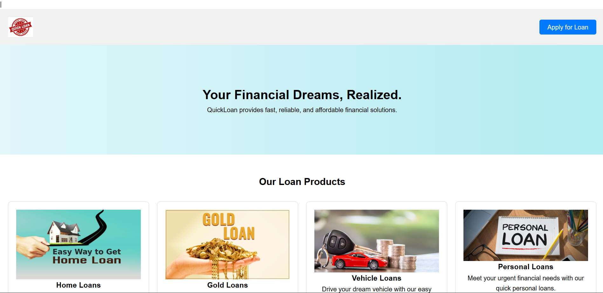
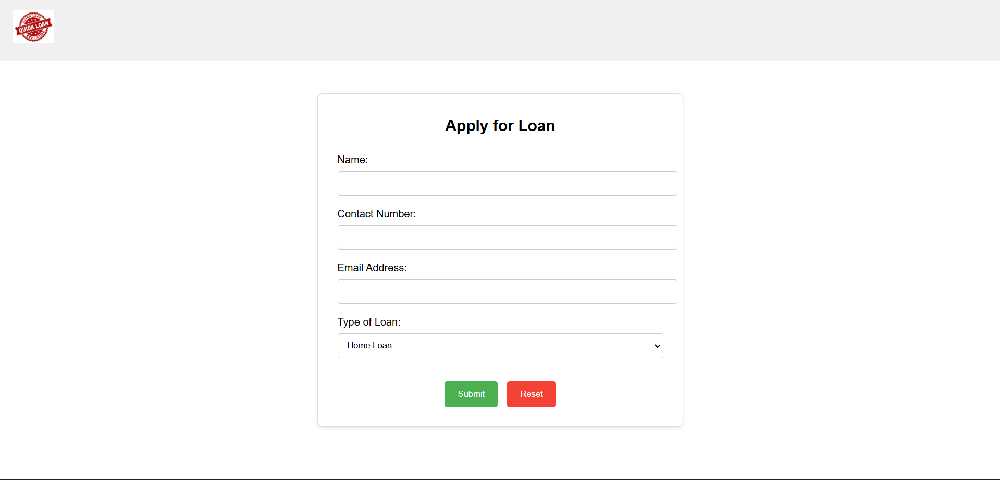
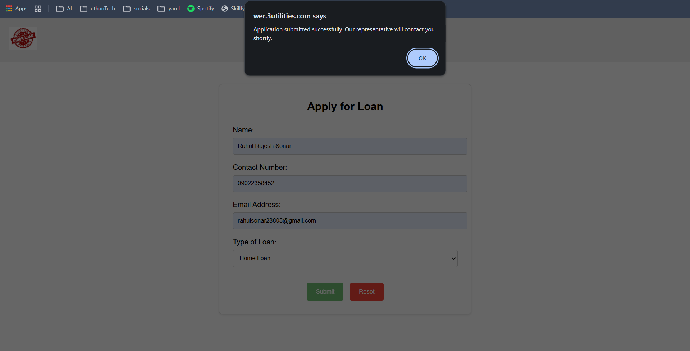
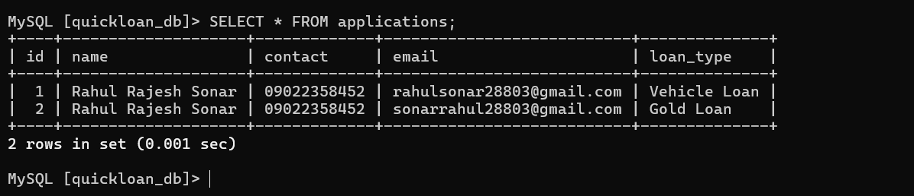

# 🚀 QuickLoan – Production-Ready Scalable PHP Web Application on AWS

## 📌 Overview

QuickLoan is a highly available and scalable PHP-based web application deployed on AWS using modern cloud architecture best practices.

This project demonstrates real-world DevOps implementation including:

- Custom VPC (Public & Private Subnets)
- Internet Gateway & NAT Gateway
- EC2 Deployment (Nginx + PHP 8.2)
- Amazon RDS (MySQL – Private Subnet)
- Application Load Balancer (ALB)
- Auto Scaling Group (Min: 3 | Desired: 4 | Max: 20)
- Amazon S3 for Static Image Hosting
- Infrastructure as Code using CloudFormation

---

# 🏗️ Architecture Overview

### 🌍 Region
`us-east-1 (N. Virginia)`

### 🌐 Network Configuration

- VPC CIDR: `172.20.0.0/16`
- 2 Public Subnets (ALB + NAT)
- 2 Private Subnets (EC2 + RDS)
- Internet Gateway
- NAT Gateway
- Private Route Tables

### 🔁 Traffic Flow

User → Application Load Balancer → EC2 (Auto Scaling Group) → RDS  
User → Amazon S3 (Static Images)

---

# 🧰 Tech Stack

| Layer | Technology |
|-------|------------|
| Frontend | HTML, CSS, JavaScript |
| Backend | PHP 8.2 |
| Web Server | Nginx |
| Database | Amazon RDS (MySQL - db.t3.micro) |
| Static Storage | Amazon S3 |
| Load Balancer | Application Load Balancer |
| Scaling | Auto Scaling Group |
| IaC | CloudFormation |

---

# 📂 Repository Structure
quickloan/ |
│
├── public/ # Frontend files |
├── includes/ # Backend logic |
├── nginx/ |
│ └── quickloan.conf |
├── database/ |
│ └── init.sql |
├── infrastructure/ |
│ └── vpc-ec2.yml |
└── README.md |

---

---

# 🖥️ Demo Screenshots

## 🔹 Application Home Page

## 🔹 Form 

## 🔹form submition Success

## 🔹 Data Stored in RDS

